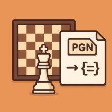

# chessPGN

[](https://github.com/JeffML/chessPGN/actions)
[](https://www.npmjs.com/package/@chess-pgn/chess-pgn)
[](https://www.npmjs.com/package/@chess-pgn/chess-pgn)
[](https://github.com/JeffML/chessPGN/stargazers)
[](https://github.com/JeffML/chessPGN/blob/main/LICENSE)

**chessPGN** is a comprehensive TypeScript chess library for chess move
generation, validation, and PGN parsing. Based on a fork of
[chess.js](https://github.com/jhlywa/chess.js), it extends the original with
powerful multi-game PGN file parsing capabilities while maintaining full
backward compatibility.

## ✨ Features

- ♟️ **Complete Chess Rules** - Move generation, validation,
  check/checkmate/stalemate detection
- 📝 **PGN Support** - Parse and generate Portable Game Notation
- 🎯 **Multi-Game Parsing** - Efficiently handle large PGN files with
  cursor-based iteration
- ⚡ **Worker Thread Support** - Parallel parsing for 3-5x performance boost on
  large files
- 🔍 **Position Analysis** - Attack detection, piece finding, board queries
- 📚 **Rich API** - Both legacy (`ChessPGN`) and modern (`Game`) interfaces
- 🎨 **TypeScript First** - Full type safety with comprehensive type definitions
- ✅ **Well Tested** - 500+ tests with high code coverage
- 📖 **Extensive Documentation** - Detailed guides and API reference

## 📦 Installation

```bash
npm install @chess-pgn/chess-pgn
```

## 🚀 Quick Start

### Basic Game

```typescript
import { ChessPGN } from '@chess-pgn/chess-pgn'

const chess = new ChessPGN()

// Make some moves
chess.move('e4')
chess.move('e5')
chess.move('Nf3')
chess.move('Nc6')

// Get current position
console.log(chess.fen())
// rnbqkbnr/pppp1ppp/2n5/4p3/4P3/5N2/PPPP1PPP/RNBQKB1R w KQkq - 2 3

// Check game state
console.log(chess.isCheck()) // false
console.log(chess.isCheckmate()) // false

// Get legal moves
console.log(chess.moves())
// ['a3', 'a4', 'b3', 'b4', 'c3', 'c4', 'd3', 'd4', ...]

// Export as PGN
console.log(chess.pgn())
// 1. e4 e5 2. Nf3 Nc6
```

### Random Game

```typescript
import { ChessPGN } from '@chess-pgn/chess-pgn'

const chess = new ChessPGN()

while (!chess.isGameOver()) {
  const moves = chess.moves()
  const move = moves[Math.floor(Math.random() * moves.length)]
  chess.move(move)
}

console.log(chess.pgn())
```

### Load and Parse PGN

```typescript
import { ChessPGN } from '@chess-pgn/chess-pgn'

const pgn = `[Event "Casual Game"]
[Site "New York"]
[Date "2025.01.15"]
[White "Alice"]
[Black "Bob"]
[Result "1-0"]

1. e4 e5 2. Nf3 Nc6 3. Bb5 1-0`

const chess = new ChessPGN()
chess.loadPgn(pgn)

console.log(chess.getHeaders())
// { Event: 'Casual Game', Site: 'New York', ... }

console.log(chess.history())
// ['e4', 'e5', 'Nf3', 'Nc6', 'Bb5']
```

### Multi-Game PGN Files

Efficiently parse large PGN files with multiple games:

```typescript
import { indexPgnGames } from '@chess-pgn/chess-pgn'
import * as fs from 'fs'

const pgnContent = fs.readFileSync('games.pgn', 'utf8')

// Create cursor with worker threads for parallel parsing
const cursor = indexPgnGames(pgnContent, {
  workers: 4,
  workerBatchSize: 10,
  onError: (err, idx) => console.error(`Game ${idx}: ${err.message}`),
})

// Iterate through games
for await (const game of cursor) {
  const headers = game.getHeaders()
  console.log(`${headers.White} vs ${headers.Black}: ${headers.Result}`)

  // Analyze final position
  if (game.isCheckmate()) {
    console.log('Checkmate!')
  }
}

// Clean up worker threads
await cursor.terminate()
```

### Position Analysis

```typescript
import { ChessPGN } from '@chess-pgn/chess-pgn'

const chess = new ChessPGN()
chess.move('e4')
chess.move('e5')
chess.move('Nf3')

// Check if square is attacked
console.log(chess.isAttacked('e5', 'w')) // true (knight attacks e5)

// Get all attackers of a square
console.log(chess.attackers('e5'))
// ['f3']

// Find pieces
console.log(chess.findPiece({ type: 'n', color: 'w' }))
// ['b1', 'f3']

// Get piece at square
console.log(chess.get('f3'))
// { type: 'n', color: 'w' }
```

### Verbose Move Details

```typescript
import { ChessPGN } from '@chess-pgn/chess-pgn'

const chess = new ChessPGN()
chess.move('e4')
chess.move('e5')
chess.move('Nf3')

// Get detailed move history
const history = chess.history({ verbose: true })
console.log(history)
/*
[
  {
    color: 'w',
    from: 'e2',
    to: 'e4',
    piece: 'p',
    san: 'e4',
    before: 'rnbqkbnr/pppppppp/8/8/8/8/PPPPPPPP/RNBQKBNR w KQkq - 0 1',
    after: 'rnbqkbnr/pppppppp/8/8/4P3/8/PPPP1PPP/RNBQKBNR b KQkq e3 0 1'
  },
  ...
]
*/
```

### Comments and Annotations

```typescript
import { ChessPGN } from '@chess-pgn/chess-pgn'

const chess = new ChessPGN()

chess.move('e4')
chess.setComment('The most popular opening move')
chess.setSuffixAnnotation('!!') // Brilliant move

chess.move('e5')
chess.setComment('Symmetric response')
chess.setSuffixAnnotation('!') // Good move

// Get all comments
const comments = chess.getComments()
console.log(comments)
/*
[
  {
    fen: 'rnbqkbnr/pppppppp/8/8/4P3/8/PPPP1PPP/RNBQKBNR b KQkq e3 0 1',
    comment: 'The most popular opening move',
    suffixAnnotation: '!!'
  },
  ...
]
*/

// Export with comments
console.log(chess.pgn())
// 1. e4!! {The most popular opening move} e5! {Symmetric response}
```

## 🎓 API Overview

### Core Classes

- **`ChessPGN`** - Legacy wrapper class with full chess functionality
- **`Game`** - Modern core implementation (can be used directly)
- **`Move`** - Rich move object with detailed information

### Common Methods

#### Position Manipulation

- `load(fen)` - Load position from FEN notation
- `reset()` - Reset to starting position
- `clear()` - Clear the board
- `fen()` - Get FEN string of current position

#### Making Moves

- `move(move)` - Make a move (SAN string or object)
- `moves()` - Get all legal moves
- `undo()` - Undo last move
- `history()` - Get move history

#### Game State

- `isCheck()` - Check if in check
- `isCheckmate()` - Check if checkmate
- `isStalemate()` - Check if stalemate
- `isDraw()` - Check if drawn position
- `isGameOver()` - Check if game is over
- `turn()` - Get side to move

#### Position Queries

- `get(square)` - Get piece at square
- `board()` - Get 2D board array
- `ascii()` - Get ASCII board representation
- `attackers(square)` - Get pieces attacking a square
- `isAttacked(square, color)` - Check if square is attacked

#### PGN Operations

- `pgn()` - Export game as PGN string
- `loadPgn(pgn)` - Load game from PGN
- `setHeader(key, value)` - Set PGN header
- `getHeaders()` - Get all headers

#### Comments and Annotations

- `setComment(comment)` - Add comment to position
- `getComment()` - Get comment for position
- `getComments()` - Get all comments
- `setSuffixAnnotation(suffix)` - Add move annotation (!!, !, ?, etc.)

### Multi-Game API

- **`indexPgnGames(pgn, options)`** - Create cursor for multi-game PGN files

Options:

- `workers` - Enable parallel parsing with worker threads
- `workerBatchSize` - Games per batch (default: 10)
- `strict` - Strict PGN parsing mode
- `onError` - Error callback for malformed games

## 📚 Documentation

- **[Full API Documentation](https://jeffml.github.io/chessPGN/)** - Complete
  API reference
- **[Advanced Features](./ADVANCED_FEATURES.md)** - Multi-game parsing, worker
  threads, cursor API
- **[Contributing Guide](./CONTRIBUTING.md)** - How to contribute to the project

## 🏗️ Architecture

chessPGN uses a **delegation pattern** where `ChessPGN` wraps the core `Game`
class:

- **`Game`** - Core chess logic, single source of truth
- **`ChessPGN`** - Legacy wrapper, delegates to `Game`
- **`IChessGame`** - Common interface for both classes

Both classes implement the same interface and produce identical results,
verified through extensive parity testing across 469 real games.

## 🔧 Development

```bash
# Install dependencies
npm install

# Run tests
npm test

# Run all checks (format, lint, test, build)
npm run check

# Build the project
npm run build

# Format code
npm run format
```

## 🧪 Testing

chessPGN has comprehensive test coverage:

- ✅ 527+ tests covering all functionality
- ✅ Unit tests for individual features
- ✅ Integration tests for real-world scenarios
- ✅ Parity tests ensuring `ChessPGN` ≡ `Game`
- ✅ Perft tests for move generation correctness

## 📊 Browser and Node.js Support

- **Node.js**: 20.x, 22.x, 24.x
- **Browsers**: All modern browsers (Chrome, Firefox, Safari, Edge)
- **TypeScript**: Full type definitions included

## 🤝 Contributing

Contributions are welcome! Please read our [Contributing Guide](CONTRIBUTING.md)
to get started.

Ways to contribute:

- 🐛 Report bugs
- 💡 Suggest features
- 📝 Improve documentation
- ✨ Submit pull requests
- ⭐ Star the repository

## 📄 License

This project is licensed under the **BSD 2-Clause License** - see the
[LICENSE](LICENSE) file for details.

## 🙏 Acknowledgments

- Based on [chess.js](https://github.com/jhlywa/chess.js) v1.4.0 (October 2025)
  by Jeff Hlywa
- Extended and maintained by Jeff Lowery
- Thanks to all
  [contributors](https://github.com/JeffML/chessPGN/graphs/contributors)

## 📞 Support

- 📖 [Documentation](https://jeffml.github.io/chessPGN/)
- 🐛 [Issue Tracker](https://github.com/JeffML/chessPGN/issues)
- 💬 [Discussions](https://github.com/JeffML/chessPGN/discussions)
